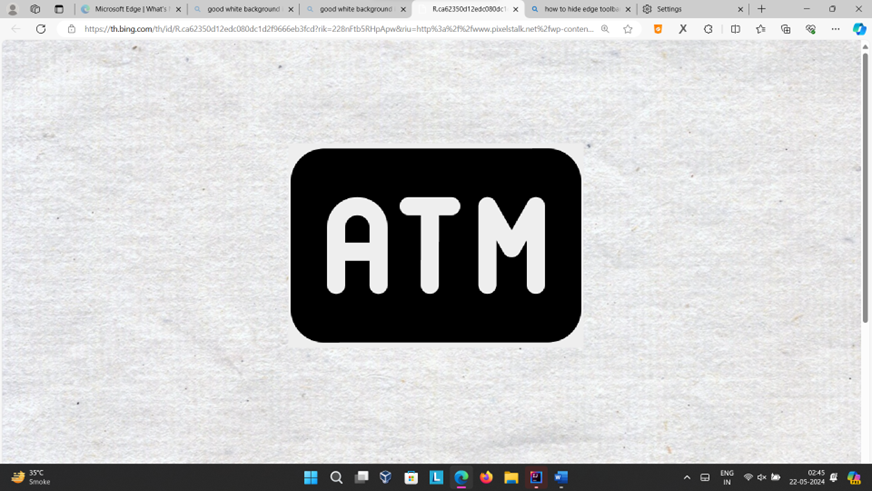
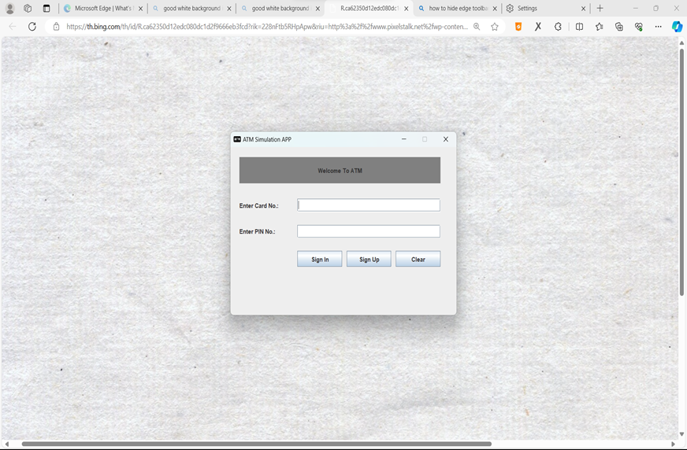
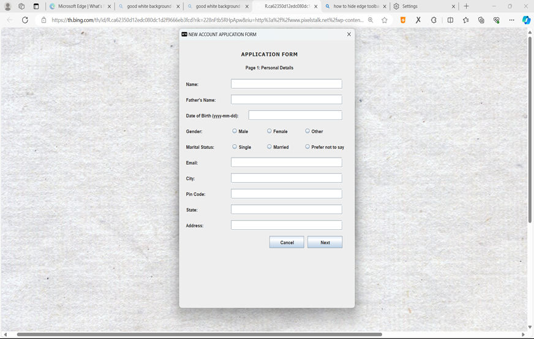
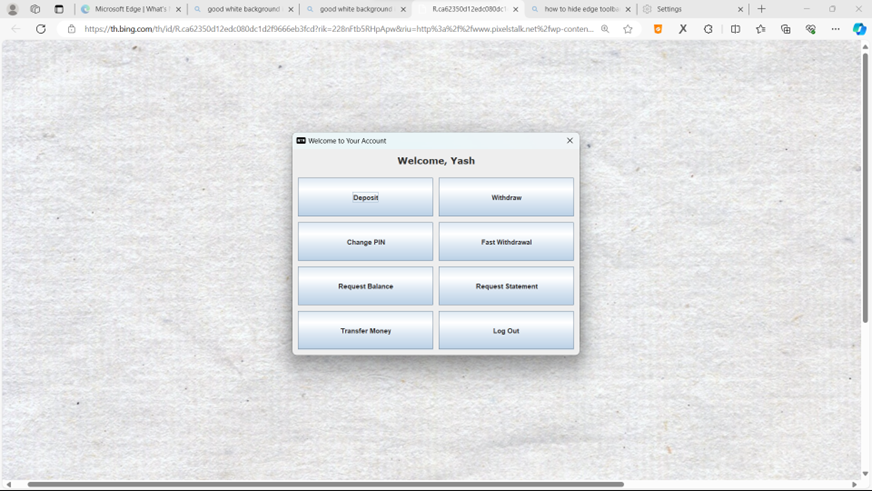
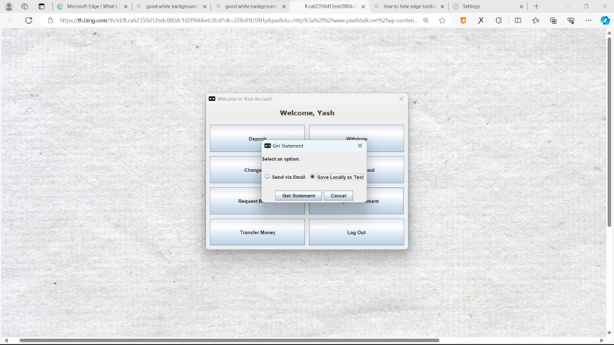

# ATM Simulation System

📟 **ATM Simulation System** is a Java-based application that simulates the functionalities of an Automated Teller Machine (ATM). The system allows users to perform various transactions like withdrawals, deposits, balance checks, and more, through a Graphical User Interface (GUI). This project aims to provide a practical demonstration of object-oriented programming and Java Swing for GUI development.

## About the Project

The ATM Simulation System offers a user-friendly interface where users can interact with the system using a card number and PIN. It provides essential ATM operations, including:

- **Withdrawals**: Withdraw money from your account.
- **Deposits**: Deposit money into your account.
- **Balance Inquiry**: Check the balance of your account.
- **Account Statements**: Request statements for your transactions.
- **User Authentication**: Secure login and registration process.

## Features

- **Graphical User Interface (GUI)**: Built with Java Swing, the system provides an interactive and intuitive user experience.
- **User Authentication**: Includes secure sign-in and sign-up processes.
- **Email Notifications**: Notifies users of successful transactions and account activities via email.
- **Persistent Storage**: Saves user data and transaction history to files for easy management.

## Screenshots

Here are some screenshots of the ATM Simulation System:

1. **Splash Screen**
   

2. **Signin Dashboard**
   

3. **Signup/Registar Dashboard**
   

4. **Main Dashborad**
   

5. **Transaction History**
   

   
## Development Environment

### IntelliJ IDEA

The project was developed using **IntelliJ IDEA**, a popular integrated development environment (IDE) by JetBrains. IntelliJ IDEA offers powerful features such as:

- **Smart Code Completion**: Provides relevant code suggestions based on context.
- **Built-in Version Control**: Integrates with Git, GitHub, and other version control systems.
- **Robust Debugging Tools**: Helps with identifying and fixing errors efficiently.
- **Cross-Platform Support**: Available on Windows, macOS, and Linux.

IntelliJ IDEA was chosen for its comprehensive support for Java development, intelligent code assistance, and seamless integration with external libraries.

## Installation

### Prerequisites

- Java Development Kit (JDK) 8 or higher
- IntelliJ IDEA or any other Java IDE
- The following external libraries must be included in the classpath:
  - `activation-1.1.jar`
  - `javax-mail-1.6.2.jar`

### Setup Instructions

1. **Clone the Repository**:
   ```bash
   git clone https://github.com/YOUR_GITHUB_USERNAME/atm-simulation-system.git
   cd atm-simulation-system
   ```

2. **Open the Project**:
   Open the project in IntelliJ IDEA.

3. **Add External Libraries**:
   - Download `activation-1.1.jar` and `javax-mail-1.6.2.jar`.
   - Add these libraries to your project's classpath.

4. **Run the Project**:
   Execute the `Main.java` file to start the ATM simulation.

# Email Service Configuration

This project includes an email notification feature implemented using the **JavaMail API**. To enable email notifications or configure a different email provider, update the email credentials used by the application.

---

## Modifying Email Service Credentials

The email credentials are defined in `EmailService.java`.

### Steps
1.  Open `EmailService.java`.
2.  Locate the following line:
    `this("your-email@example.com", "your-email-password");`
3.  **Replace:**
    * `your-email@example.com` with your Gmail address.
    * `your-email-password` with a **Gmail App Password**.

---

## Gmail App Password Setup

For security reasons, do not use your main Gmail password. Instead, use a Google App Password.

**Prerequisite:** 2-Step Verification must be enabled on your Google account.

### Step 1: Enable 2-Step Verification
1.  Visit [myaccount.google.com/security](https://myaccount.google.com/security).
2.  Under **How you sign in to Google**, enable **2-Step Verification**.
3.  Complete the verification process.

### Step 2: Generate a Gmail App Password
1.  Go to [myaccount.google.com/apppasswords](https://myaccount.google.com/apppasswords).
2.  Sign in to your Google account.
3.  **Select:**
    * **App:** Mail
    * **Device:** Other (Custom) → enter a name (e.g., *JavaMail*)
4.  Click **Generate**.
5.  Copy the generated **16-character app password**.

### Step 3: Update EmailService.java
Update the constructor with your new credentials:
`this("your-email@gmail.com", "abcdefghijklmnop");`

---

## SMTP Settings (Gmail)

| Property | Value |
| :--- | :--- |
| `mail.smtp.host` | `smtp.gmail.com` |
| `mail.smtp.port` | `587` |
| `mail.smtp.auth` | `true` |
| `mail.smtp.starttls.enable` | `true` |

---

## Security Best Practices

> [!IMPORTANT]
> * **Never** use your primary Gmail password in the code.
> * **Never** commit credentials to version control (use `.gitignore` further).
> * Use **environment variables** for production environments.
> * Revoke the app password immediately if it is compromised.

---

## Troubleshooting

### App Password Option Not Visible
* Ensure **2-Step Verification** is fully enabled.
* Work or school Google accounts may restrict the creation of app passwords.
* Try logging out and signing back in to your Google account to refresh settings.

---

## Notes
* App passwords are application-specific.
* Revoking an app password immediately disables email access for that specific instance.
* Compatible with standard JavaMail configurations.

Got it 👍 — the issue is **formatting**, not content.
Below is **plain text Markdown** with **NO code fences around the whole thing**, so you can **select + copy normally**.

Just copy everything you see.

---

# Running the Java Project (VS Code / Terminal)

This project is a plain Java application (no Maven or Gradle) and is compiled and executed using the command line.
External libraries are stored in the `exLib` directory.

---

## Project Structure

```
src/
├── Main.java
├── EmailService.java
├── OTPManner.java
├── ChangePIN.java
├── Deposit.java
├── ...
├── exLib/
│   ├── activation-1.1.jar
│   └── javax.mail-1.6.2.jar
```

---

## Compile the Project

Navigate to the `src` directory:

```
cd src
```

Compile all Java source files and include external libraries:

```
javac -cp "exLib/*" *.java
```

Note: You may see warnings about deprecated APIs. These do not prevent the program from running.

---

## Run the Application

After successful compilation, run the main class:

```
java -cp ".:exLib/*" Main
```

* `.` refers to the current directory
* `exLib/*` includes all external JAR files
* `Main` is the entry-point class

---

## Common Issues

### Could not find or load main class Main

* Make sure you are inside the `src` directory
* Ensure `Main.java` contains a `main` method
* Recompile before running

### package javax.mail does not exist

* Confirm JAR files exist inside `exLib`
* Compile using:

  javac -cp "exLib/*" *.java

---

## Optional: One-Command Run Script (Linux)

Create a file named `run.sh` inside the `src` directory:

```
#!/bin/bash
javac -cp "exLib/*" *.java && java -cp ".:exLib/*" Main
```

Make it executable:

```
chmod +x run.sh
```

Run the project:

```
./run.sh
```

---


* 
## Built With

- **Java Swing**: For building the GUI.
- **JavaMail API**: For handling email notifications.
- **Java AWT**: For additional GUI components.
- **Java IO**: For handling input/output operations.
- **Java Util**: For utility classes like ArrayList and HashMap.

## License

This project is licensed under the MIT License. See the [LICENSE](./LICENSE) file for more details.

## Author

Yash Kayastha

Feel free to contribute to the project by forking the repository and submitting pull requests. For major changes, please open an issue first to discuss what you would like to change.

