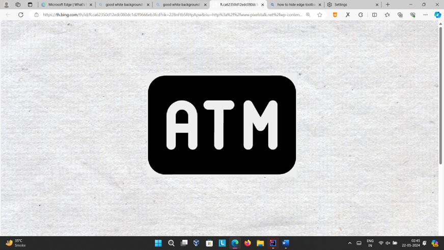

# ATM Simulation System

📟 **ATM Simulation System** is a Java-based application that simulates the functionalities of an Automated Teller Machine (ATM). The system allows users to perform various transactions like withdrawals, deposits, balance checks, and more, through a Graphical User Interface (GUI). This project aims to provide a practical demonstration of object-oriented programming and Java Swing for GUI development.

## About the Project

The ATM Simulation System offers a user-friendly interface where users can interact with the system using a card number and PIN. It provides essential ATM operations, including:

- **Withdrawals**: Withdraw money from your account.
- **Deposits**: Deposit money into your account.
- **Balance Inquiry**: Check the balance of your account.
- **Account Statements**: Request statements for your transactions.
- **User Authentication**: Secure login and registration process.

## Features

- **Graphical User Interface (GUI)**: Built with Java Swing, the system provides an interactive and intuitive user experience.
- **User Authentication**: Includes secure sign-in and sign-up processes.
- **Email Notifications**: Notifies users of successful transactions and account activities via email.
- **Persistent Storage**: Saves user data and transaction history to files for easy management.

## Screenshots

Here are some screenshots of the ATM Simulation System:

1. **Splash Screen**
   

2. **Signin Dashboard**
   

3. **Signup/Registar Dashboard**
   

4. **Main Dashborad**
   

5. **Transaction History**
   

   
## Development Environment

### IntelliJ IDEA

The project was developed using **IntelliJ IDEA**, a popular integrated development environment (IDE) by JetBrains. IntelliJ IDEA offers powerful features such as:

- **Smart Code Completion**: Provides relevant code suggestions based on context.
- **Built-in Version Control**: Integrates with Git, GitHub, and other version control systems.
- **Robust Debugging Tools**: Helps with identifying and fixing errors efficiently.
- **Cross-Platform Support**: Available on Windows, macOS, and Linux.

IntelliJ IDEA was chosen for its comprehensive support for Java development, intelligent code assistance, and seamless integration with external libraries.

## Installation

### Prerequisites

- Java Development Kit (JDK) 8 or higher
- IntelliJ IDEA or any other Java IDE
- The following external libraries must be included in the classpath:
  - `activation-1.1.jar`
  - `javax-mail-1.6.2.jar`

### Setup Instructions

1. **Clone the Repository**:
   ```bash
   git clone https://github.com/YOUR_GITHUB_USERNAME/atm-simulation-system.git
   cd atm-simulation-system
   ```

2. **Open the Project**:
   Open the project in IntelliJ IDEA.

3. **Add External Libraries**:
   - Download `activation-1.1.jar` and `javax-mail-1.6.2.jar`.
   - Add these libraries to your project's classpath.

4. **Run the Project**:
   Execute the `Main.java` file to start the ATM simulation.

## Modifying Email Service Credentials

The system includes an email notification feature that uses the JavaMail API. If you need to enable email notifications or use a different email service, you'll need to edit the credentials in `EmailService.java`:

1. Open `EmailService.java`.
2. Find the following lines:
   ```java
   this("your-email@example.com", "your-email-password");
   ```
3. Replace `"your-email@example.com"` with your email address and `"your-email-password"` with your email password or an app-specific password.

**Note:** For security reasons, avoid using your main email password. Instead, use an app-specific password if your email provider supports it.

## Built With

- **Java Swing**: For building the GUI.
- **JavaMail API**: For handling email notifications.
- **Java AWT**: For additional GUI components.
- **Java IO**: For handling input/output operations.
- **Java Util**: For utility classes like ArrayList and HashMap.

## License

This project is licensed under the MIT License. See the [LICENSE](./LICENSE) file for more details.

## Author

Yash Kayastha

Feel free to contribute to the project by forking the repository and submitting pull requests. For major changes, please open an issue first to discuss what you would like to change.

